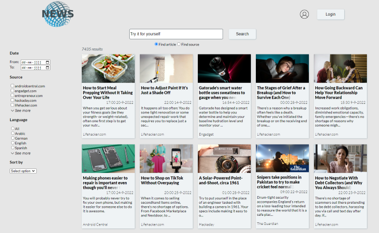
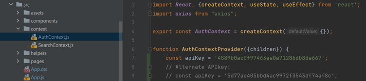

# News app
## Installatiehandleiding

## Inhoudsopgave

>[1. Inleiding](#inleiding)
> 
>[2. Installeren en opstarten](#installeren-en-opstarten) 
>
>>2.1 Benodigdheden voor applicatie
>>
>>2.2 Installatie stappenplan
>
>[3. Functies van de app in gebruik](#functies-van-de-app-in-gebruik)
>
>>3.1 Een account aanmaken
>>
>>3.2 Inloggen
>>
>>3.3 Zoeken

---------------------------------
<h2>
    <a id="inleiding">
        1. Inleiding
    </a>
</h2>

We weten allemaal dat het bij nieuws goed is om meerdere bronnen te checken: op die manier krijg je het meest complete beeld van een situatie. Alle bronnen handmatig checken is gedoe, daar heeft niemand zin in.  
News app is hiervoor de oplossing: de app geeft toegang tot nieuwsbronnen van over de hele wereld, je hebt nog maar één zoekopdracht nodig voor al het nieuws dat je wilt lezen.

Wat kan je met News app:
- Op de homepagina worden de meest recente “headlines” uit Nederland getoond.
- Je kan een profiel aanmaken en inloggen. In je profiel kan je een land selecteren en opslaan. Op de homepagina worden dan de headlines uit dat land getoond.
- De gebruiker kan door de uitgebreide zoekfunctionaliteit een overzicht van artikelen per onderwerp opvragen.
- Ook is het mogelijk om per bron het meest recente nieuws te bekijken door een bron-zoekopdracht te doen.
- Per zoekopdracht zijn diverse filters mogelijk om de resultaten nog verder te verfijnen.

--------------------------

<h2>
    <a id="installeren-en-opstarten">
        2. Installeren en opstarten
    </a>
</h2>

### 2.1 Benodigdheden voor de applicatie

####API key
Om gebruik te maken van de app moet een geldige API key gebruikt worden. Deze staat al ingevoerd in AuthContext.js, dus het is in principe niet nodig om hier iets voor te doen.
De API heeft een beperking in het aantal opdrachten dat het kan verwerken. Mocht er een error ontstaan door veelvuldige zoekopdrachten, dan kan in AuthContext de tweede apiKey geselecteerd worden door de huidige apiKey te deactiveren (dit doe je door `//` voor de regel te plaatsen) en de alternate apiKey te activeren (dit doe je door de `//` aan het begin van de regel te verwijderen).

### 2.2 Installatie stappenplan

1. Haal het project binnen vanuit Github op een manier naar keuze. Omdat iedereen hier een eigen voorkeur in heeft, wordt het exacte clonen hier niet verder gespecificeerd. Het project is te vinden op:
   https://github.com/AN-WM/Eindopdracht-Frontend-ANWM
2. Open het project in een IDE naar keuze.
3. Om de app te kunnen draaien, is NPM nodig. De installatie daarvan is eenvoudig. Open de terminal van de IDE, en voer daarin het commando `npm install` in. Druk op enter om de installatie te starten.
4. Wanneer NPM geïnstalleerd is, kan de applicatie gestart worden. Voer hiervoor het commando `npm start` in, in de terminal van de IDE en druk op enter. De applicatie zal nu in een nieuw browsertabblad geopend worden.

--------------------------
<h2>
    <a id="functies-van-de-app-in-gebruik">
        3. Functies van de app in gebruik
    </a>
</h2>

### 3.1 Een account aanmaken
1.	Navigeer naar de registratiepagina. Dit kan door direct http://localhost:3000/register in de browser in te voeren, of door op de “login” knop rechtsbovenaan de pagina te klikken, en vervolgens onder de “login” knop te klikken op “New user? Click here to register.”
2.	Vul de invoervelden in, rekening houdend met de gestelde eisen per veld, die onder elk veld zichtbaar zijn.
3.	Klik op de “register” knop onderaan de pagina, of druk op enter, en de account wordt aangemaakt.

### 3.2 Inloggen
1. Navigeer naar de inlogpagina. Dit kan door direct http://localhost:3000/login in de browser in te voeren, of door op de “login” knop rechtsbovenaan de pagina te klikken.
2. Vul de eerder aangemaakte gebruikersnaam en wachtwoord in, en klik op de “login” knop onderaan de pagina, of druk op enter.
3. De gegevens worden gecontroleerd, en wanneer deze in de database gevonden zijn wordt het inlogproces voltooid.

Let op! Omdat de Novi database (waarin gebruikers opgeslagen worden) vaak al binnen één uur geleegd wordt, kan het zijn dat een eerder aangemaakte account niet meer herkend wordt. Maak in dat geval een nieuwe account aan volgens de stappen bij hoofdstuk 3.1 (een account aanmaken).

### 3.3 Zoeken
1.	Voer de gewenste zoekterm in, in de zoekbalk middenbovenaan de pagina.
2.	Selecteer ófwel de ‘article’-optie om artikelen bij de zoekterm te vinden, óf de ‘source’-optie om nieuwsbronnen bij de zoekterm te vinden.
3.	Klik op de ‘search’-knop om de zoekopdracht te starten, of druk op enter.
4.	De zoekpagina toont nu de gevonden resultaten (of geeft een foutmelding weer wanneer er geen resultaten gevonden zijn).
5.	In de linkerkolom zijn diverse filteropties beschikbaar om de zoekopdracht verder te verfijnen. Door hierin opties te selecteren wordt het zoekresultaat direct aangepast. 
